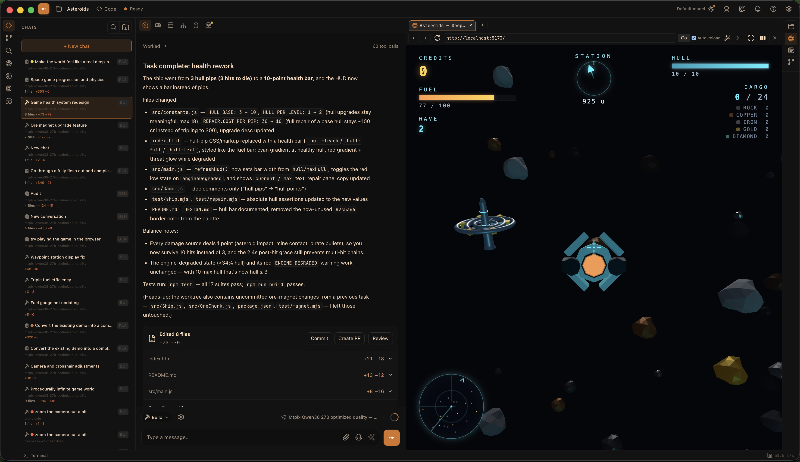
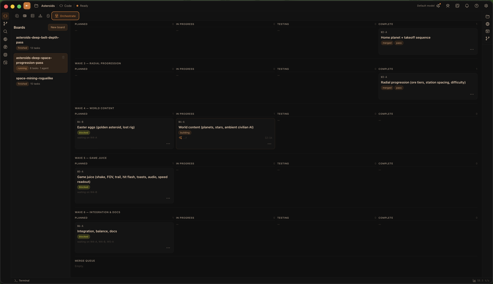

# Minnow

**A free and open source, local-first development workspace.**

[](LICENSE)
[](https://github.com/HenriGrimm/Minnow/releases)
[](https://discord.gg/U4FPzv9K4X)
[](https://github.com/sponsors/HenriGrimm)

Editor, terminal, git, issues, planning, agents, research, and local model hosting — one app, running on any model or provider you point it at.

Keys, chats, files, and models stay on your disk, which is a sentence that used to be too obvious to write down. There are no accounts, no subscriptions, and no usage limits. It's [AGPL-3.0-or-later](LICENSE): free forever in the durable sense rather than the promotional one.

You pick a workspace folder, land in **Code**, and work with chat beside the repo it's editing.



---

## Quick start

Download a packaged build from **[Releases](https://github.com/HenriGrimm/Minnow/releases)**. That is how you run Minnow.

| Platform | What you download |
|----------|-------------------|
| Windows | NSIS installer (`.exe`) |
| macOS | `.dmg` (or `.zip` into Applications) |
| Linux | AppImage — `chmod +x` and run it |

First launch, SmartScreen, tray, and updates: **[Install and first launch](documentation/manual/get-started/install.md)**. Packaged builds check GitHub Releases in the background (Settings → General → App updates).

You supply the model. Minnow ships no weights and has no built-in provider: point it at LM Studio, Ollama, `llama-server`, or any OpenAI-compatible API, or let it host a model for you. It holds no opinion about which one you choose, and will let you make your own mistakes at any scale you like.

### Build from source

Clone and `npm start` only if you are developing Minnow itself. Node 18+, then:

```bash
git clone https://github.com/HenriGrimm/Minnow.git
cd Minnow
npm install && npm start
```

Full steps: [Setup from source](documentation/contributor/setup-from-source.md).

---

## What's in it

| | |
|---|---|
| **A coding workspace** | Editor with language-server intelligence, terminal, git, dev servers, real Chromium preview. |
| **Chat beside the repo** | Sessions in the Code rail: modes, attachments, voice, notifications. Same files, git, and terminals you're using. |
| **Git & GitHub** | A dedicated Source Control app: changes, history, branches, stashes, worktrees, pull requests, and CI. |
| **Planning** | Super Plan takes an idea to a reviewed, buildable spec without writing code. |
| **Task orchestration** | Boards that run a plan as waves of Builder and Tester agents in isolated git worktrees. |
| **Issue tracker** | A list and board the agent can file to, triage, and work through itself. |
| **Intent-based coding** | Type what a line should do in plain English; Tab turns it into code. |
| **Autocomplete** | Inline ghost text, with language-server context behind it. |
| **Quick Edit** | Ctrl+K turns a description into a diff on your selection. |
| **Code map** | A symbol and call-graph index of your repos, for you and for the agent. |
| **Deep research** | Multi-round searching, reading, and synthesis into a saved report. |
| **Local model hosting** | Hardware-fit scoring, Hugging Face downloads, and serving models through `llama-server`. |
| **Multi-model routing** | Bind different models to different jobs: chat, titles, research, review, each agent role. |
| **Scheduled tasks** | Recurring agent jobs on an interval or cron, with run history. |
| **Loops and goals** | `/loop` re-runs a prompt on a schedule; `/goal` keeps working until an evaluator agent says the condition is met. |
| **Brain** | A markdown knowledge wiki with semantic recall, read and written by the assistant. |

Behind it, **103 built-in tools**: files, git, LSP, terminal, web, browser automation, sub-agents. Each one can be Full, Ask, or Off, on the principle that a program able to run shell commands should occasionally check in.

---

## How it fits together

**Code is the workspace.** Five surfaces support it from the app rail — Research, Models, Brain, Issues, and Scheduler — plus Settings from the menubar. They share one chat engine, one tool set, one session store, and one workspace root you choose when you open a project.

Three processes: the Electron shell, the SPA it loads, and a Node server that runs the tools and owns everything persisted under `~/.minnow`. Details in [Architecture](documentation/contributor/architecture.md).

---

## Code

File tree, CodeMirror with language-server intelligence and inline completion, terminal tabs, source control, dev servers, and a real Chromium preview. **Ctrl+K** turns a description into a diff on your selection. **Intent mode** turns a line of plain English into code you accept with Tab. Chat sits beside the project rather than in another window, driving the same files, git, and terminals you are.

The sidebar source-control panel handles the everyday loop (stage, diff, commit, push) and can write the commit message from your staged diff. The dev-server screen registers the servers a project needs (command, cwd, port, auto-start, which worktree), and the model drives the same controls, so "start the dev server and check the console" is one instruction. **Code map** indexes symbols and call relationships across the repo.


### Source Control Center

Opens as its own app from the navigation rail or the source-control panel. Your chat stays intact. A left rail routes between seven sections in two groups: **Changes**, **History**, **Branches**, **Stashes**, and **Worktrees** for the working tree, then **Pull requests** and **Checks** for the remote. Each section carries its own count; Checks shows a status dot when CI is red. **Ctrl+1**–**7** jumps between them, **Esc** closes.

Pull requests and CI run through your own `gh` CLI. Minnow stores no GitHub token: if `gh` isn't installed or authed, or the remote isn't GitHub, those two sections say so instead of showing an empty list. An empty list is a lie a great deal of software tells. With it working, you get PR list and detail, create, checkout, merge, close and mark-ready; workflow runs down to jobs and steps, with the failed step's log one click away, and rerun (all or failed-only) or cancel on the run itself.


### Orchestrator boards

Turn a plan into waves of tasks, hand them to Builder and Tester agents in isolated git worktrees, and merge at the end. Drive it task by task, or let it run and discover what you actually specified.



### Super Plan

Interview, spec, research, draft, review, polish, final. Super Plan takes an idea to a reviewed plan in `documentation/plans/` without writing code along the way.

---

## The supporting surfaces

### Models

Everything the agents run on: hardware-fit scoring, Hugging Face downloads, local serving through `llama-server`, providers, per-role routing, sampler and thinking defaults, and token usage with cost. Routing binds models to roles — main chat, chat titles, the `/goal` evaluator, research, review, and each agent type — instead of making one model do everything.


### Brain

A markdown wiki in your Minnow home: graph view, page editing, an append-only log, AI proposals awaiting review, memories, ingest, lint, and a code-symbol index of your repositories. The assistant reads and writes it with tools.


### Research

Several rounds of searching, reading, and synthesis behind a progress stepper, scoped to the web, your codebase, or both. Reports save to a library you can reopen and discuss. Fetched page text is fenced as untrusted data before the model sees it.


### And the rest

<table>
<tr>
<td width="33%" valign="top">
<b>Settings</b>: appearance, providers, prompts, agents, skills, and app preferences.
</td>
<td width="33%" valign="top">
<br>
<b>Issues</b>: list and board tracking the agent can file, triage, and work through itself.
</td>
<td width="33%" valign="top">
<br>
<b>Scheduler</b>: recurring agent jobs on an interval or cron, with run history.
</td>
</tr>
</table>

Full tour: **[Apps guide](documentation/manual/apps/overview.md)**.

---

## Extending it

- **Skills**: drop a `SKILL.md` into `~/.minnow/skills/` and call it with `/` in the composer. Nineteen ship built in; install more from the Skills Library, or write your own.
- **Tools**: add local tools under `~/.minnow/tools/` with no MCP server required ([tool authoring](documentation/plugins/tool-authoring.md)), or connect any MCP server you like.
- **Agents**: define sub-agents and work agents with their own prompts, models, samplers, and context budgets.
- **Prompts and modes**: every system prompt in the app is a markdown file in the repo. Edit them.
- **Themes**: sixteen built in, which is fifteen more than strictly necessary; the whole UI is `--mn-*` tokens in one file.


- **The source**: it's AGPL. Fork it, strip it, rebuild it, ship it; derivatives stay AGPL.

---

## Privacy

- Chats, config, Brain, models, and secrets live under `~/.minnow` on your disk.
- Provider keys and passwords are encrypted at rest (AES-256-GCM).
- Network access is loopback-only until you opt in.
- Web search uses the provider you pick. There is no telemetry and no phone-home. Nobody here knows you installed it.

---

## Status

One maintainer and a small community. It is a work in progress, meaning parts of it are unfinished and you will find the edges before I do. Bug reports are genuinely useful. If something is broken, confusing, or missing, say so.

- 💬 [Discord](https://discord.gg/U4FPzv9K4X)
- 🐛 [Issues](https://github.com/HenriGrimm/Minnow/issues)
- ❤️ [Sponsor](https://github.com/sponsors/HenriGrimm): development is funded by the people who use it.

Pull requests, docs fixes, skills, and themes are all welcome. Working in the codebase? Start with [AGENTS.md](AGENTS.md) and [documentation/context.md](documentation/context.md).

---

## Documentation

| Doc | What's in it |
|-----|--------------|
| [Install](documentation/manual/get-started/install.md) | Packaged desktop app from Releases |
| [Setup from source](documentation/contributor/setup-from-source.md) | Clone and `npm start` for development |
| [Apps](documentation/manual/apps/overview.md) | Code and the surfaces around it |
| [Skills and commands](documentation/manual/chat/skills-and-commands.md) | `/` skills, the Skills Library, `/goal`, `/loop` |
| [Commands](documentation/contributor/commands.md) | Every script, flag, and environment variable |
| [Configuration](documentation/manual/reference/configuration.md) | `~/.minnow`, providers, secrets |
| [Architecture](documentation/contributor/architecture.md) | How the three processes fit together |
| [Troubleshooting](documentation/manual/reference/troubleshooting.md) | When something won't start |

Full index: [documentation/](documentation/README.md).

---

**License:** [GNU AGPL-3.0-or-later](LICENSE). Third-party notices: [THIRD_PARTY_NOTICES.md](documentation/THIRD_PARTY_NOTICES.md).
